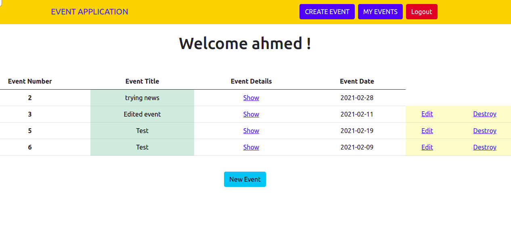
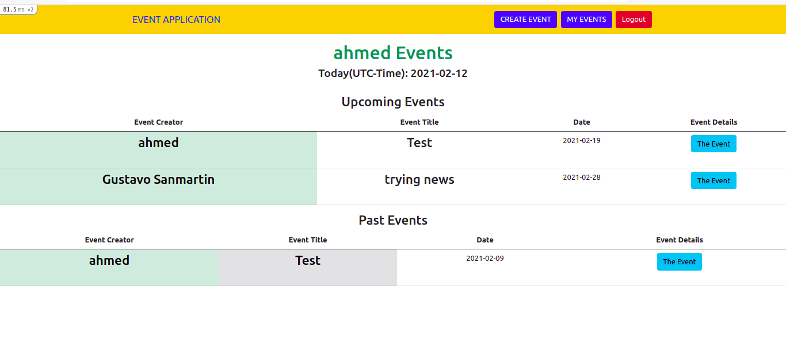

# Association: Private Events!
 
> In this project, we created an application using Ruby on Rails for creating events and enable users to attend to these events, including the model structure, associations, controllers, views, validations, and authentications, stylized with Bootstrap.
- Consists of T models: User, Post
- Only 'Sing Up' members are allowed to create and attend events.
- Only creator user is allowed to edit and delete his event.




- Each user can see a list of his events, and these events are classified into two parts: upcoming and past events:



## Built With
- Ruby (v. 2.7.2)
- Ruby on Rails (v. 6.1.1)
- Rubocop
- Capybara
- Bootstrap gem
- Devise gem
 
### Setup

1. To run this project locally, please ensure you have Ruby and Ruby on Rails installed on your machine.
2. Open the terminal.
3. Clone this repository by running:

```bash
git clone https://github.com/gasb150/private-events
```

4. Install gems: Enter to the folder of the project in your local machine and After that write in the terminal:

```bash
bundle install
```

5. Open the local server:

```bash
bin/rails server
```

## Authors

**Ahmed Amin** 
- GitHub: [@AhmedAmin90](https://github.com/AhmedAmin90)
- LinkedIn: [Ahmed Amin](https://www.linkedin.com/in/web-developer/)

**Gustavo Sanmartin**
- GitHub: [@gasb150](https://github.com/gasb150)
- LinkedIn: [Gustavo Sanmartin](https://www.linkedin.com/in/gustavsanmartin/)

## Contribute :point_left:
Any advice and suggestion for improvement are more than welcome.
Visit [issues' section](https://github.com/AhmedAmin90/members-new-rails/issues)

## Show your support
Give a :star2: if you like this project!

## License
<p>This project is <a href="./LICENSE">MIT</a> licensed.</p>